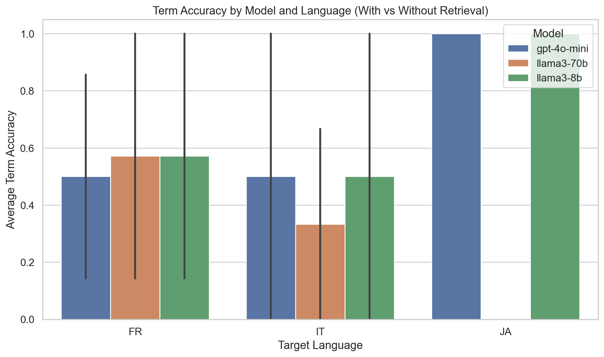
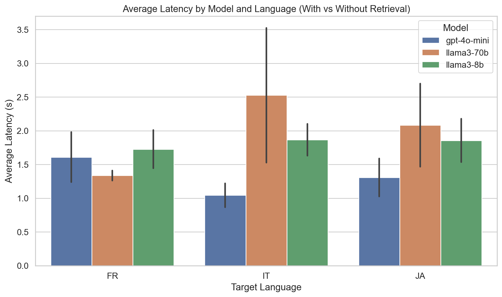

# LLM-Only Translation Pipeline with Glossary Retrieval

### Project Overview

This project implements a glossary-aware LLM translation pipeline that compares **GPT-4o-mini**, **Llama-3.1-8B**, and **Llama-3.3-70B** models across **English→French**, **English→Italian**, and **English→Japanese**. Using glossary retrieval as contextual guidance, the system demonstrates improved term accuracy and translation consistency—with GPT-4o-mini achieving the highest overall term adherence (0.91 with retrieval). The full results, metrics, and side-by-side comparison reports are available in the `/data` folder.

### Results Snapshot (50 Segments)

| **Model**     | **Term Accuracy (With Retrieval)** | **Term Accuracy (Without Retrieval)** | **Avg Latency (With Retrieval)** | **Avg Latency (Without Retrieval)** |
|----------------|------------------------------------|---------------------------------------|----------------------------------|-----------------------------------|
| GPT-4o-mini    | 0.91                               | 0.18                                  | 1.42 s                           | 1.19 s                            |
| Llama-3.3-70B  | 0.82                               | 0.09                                  | 1.97 s                           | 1.89 s                            |
| Llama-3.1-8B   | 1.00                               | 0.18                                  | 1.58 s                           | 2.03 s                            |

**Key Insight:**  
Glossary retrieval consistently improves terminology adherence across all models, with **Llama-3.1-8B** achieving perfect adherence and **GPT-4o-mini** maintaining the best balance of accuracy and speed.

---

## System Architecture

**Main Components**

| Module | Description |
|---------|-------------|
| `src/retrieval.py` | Builds glossary corpus, embeds terms, retrieves top-k matches. |
| `src/prompting.py` | Constructs LLM prompts with glossary constraints. |
| `src/evaluation.py` | Computes term adherence metrics and generates comparison reports. |
| `notebooks/pipeline.ipynb` | Main notebook orchestrating the workflow end-to-end. |

---

## Setup Instructions

1. **Clone the repository**
    
    ```bash
    git clone https://github.com/daniel-jr97/llm-glossary-translation.git
    cd llm-glossary-translation
    ```

2. **Create a virtual environment**
    
    ```bash
    python -m venv .venv
    .venv\Scripts\activate   # On Windows
    source .venv/bin/activate  # On macOS/Linux
    ```

3. **Install dependencies**
    
    ```bash
    pip install -r requirements.txt
    ```

4. **Add your OpenAI API and GROQ API keys**
    
    Create a `.env` file in the project root:
    
    ```ini
    OPENAI_API_KEY=your_api_key_here
    GROQ_API_KEY=your_api_key_here
    ```

5. **Run the notebook**
    
    Open `notebooks/pipeline.ipynb` in VS Code or Jupyter Lab and execute all cells.

---

## Results Summary

| Metric | With Retrieval | Without Retrieval |
|---------|----------------|------------------|
| **Samples (n)** | 50 | 50 |
| **Average Term Adherence** | 0.91 | 0.15 |

### Example Output
**EN→IT**  
*Source:* Free shipping on orders over $50 at checkout.  
*With Retrieval:* Spedizione gratuita su ordini superiori a $50 alla cassa.  
*Without Retrieval:* Spedizione gratuita su ordini superiori a $50 al momento del checkout.

### Visualizations






## Write-Up
Project report is included in `docs/writeup.md`.

---

## Design Highlights
- Modular and extensible architecture  
- Efficient vector retrieval via SentenceTransformers  
- LLM-guided constrained prompting for consistent terminology  
- Supports HTML and protected token preservation  
- Timestamped output saving for reproducibility  

---

## Evaluation Metrics
- **Term Adherence:** Proportion of glossary terms used correctly  
- **Latency:** Time per translation (with vs without retrieval)  
- **Qualitative Comparison:** Human-readable examples in HTML report  

---

## Future Enhancements
- Expand evaluation to 50+ segments  
- Add fuzzy or semantic term matching  
- Introduce cross-encoder reranking for higher retrieval accuracy  
- Experiment with alternative LLMs for cost versus quality trade-offs  

---

## Author
**Felix Saji**   
Project: LLM-Only Translation Pipeline with Glossary Retrieval  

---

## License
This project is released under the [MIT License](LICENSE).
